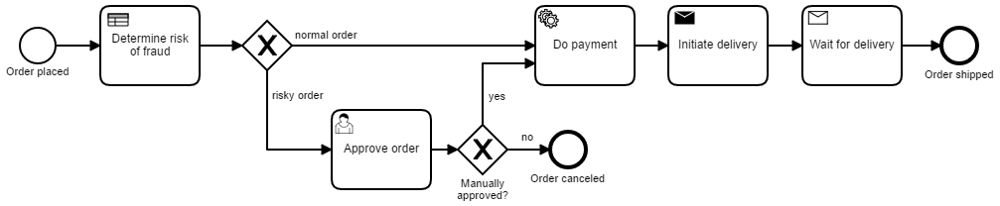
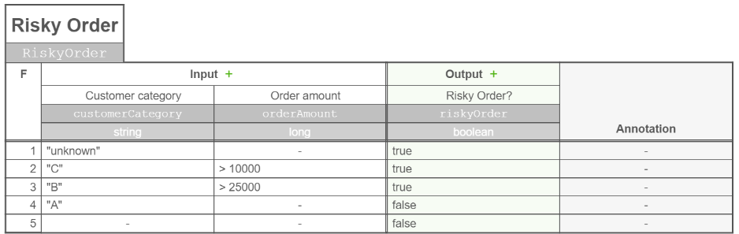

# Simple flowing-retail application using Camunda 

The [https://github.com/flowing/flowing-retail] sample system is the "big brother" of this application and implements an overall order system using a couple of collaborating microservices. 
This application uses the same business story, but implements it as one simple Maven project, forming a Camunda process application, deployable on a container running Camunda (e.g. Tomcat or WildFly). 

# How to run

```
mvn install
cp target/flowing-retail-camunda-intro.war %DEPLOYMENT_FOLDER%/
```

Goto 

 and start a new process instance from there. 

# What does it demonstrate?

## Flows

You can define [long running flows](https://blog.bernd-ruecker.com/what-are-long-running-processes-b3ee769f0a27#.wpw8hrmux) easily, either by code:

```
kafka-topics.sh --create --zookeeper localhost:2181 --replication-factor 1 --partitions 1 --topic flowing-retail
```

or by using the graphical notation BPMN:



## Decision tables

You can also leverage decision tables in DMN using Camunda:


